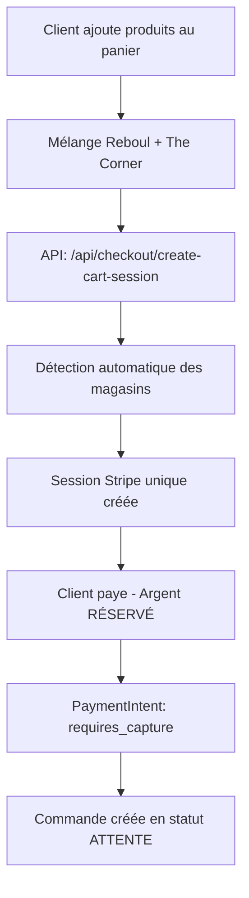
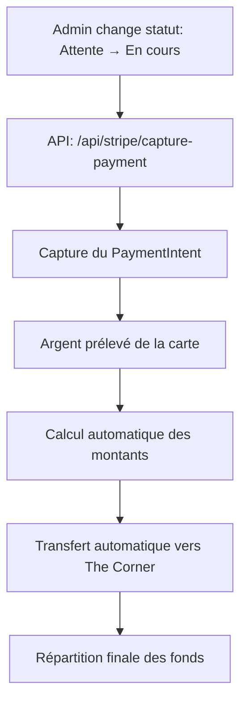

# 🚀 Guide Complet - Système de Paiement Reboul + The Corner

## 📋 Vue d'ensemble

Ce système permet de **créer une seule session de paiement** pour des commandes contenant des produits de deux magasins différents (Reboul et The Corner), avec **répartition automatique** des fonds via Stripe Connect.

---

## 🔄 Workflow Complet

### **Phase 1 : Création de la commande (Statut "Attente")**



**Détails techniques :**
- **Détection magasin** : ID > 50 = Reboul, ID ≤ 50 = The Corner
- **Capture method** : `manual` (pas de prélèvement immédiat)
- **Métadonnées** : Tous les détails stockés dans la session
- **Argent** : Réservé sur la carte, pas prélevé

### **Phase 2 : Traitement de la commande (Statut "En cours")**



**Détails techniques :**
- **Capture** : Prélèvement définitif sur la carte
- **Transfert automatique** : Montant The Corner → `acct_1RlnwI2QtSgjqCiP`
- **Répartition** : Reboul garde sa part, The Corner reçoit sa part

### **Phase 3 : Répartition finale**

```
💰 Exemple avec commande 545€ :
├── 🏪 Reboul (MERCER - 165€)
│   ├── Reçoit : 545€ (paiement total)
│   └── Garde : 165€ (après transfert)
└── 🏬 The Corner (Veste - 380€)
    └── Reçoit : 380€ (via transfert Stripe)
```

---

## 🔧 API Endpoints

### **1. Création de session**
```bash
POST /api/checkout/create-cart-session
```
**Utilisation :** Créer une session de paiement unique pour tous les produits

### **2. Capture du paiement**
```bash
POST /api/stripe/capture-payment
Body: { "payment_intent_id": "pi_xxx" }
```
**Utilisation :** Finaliser le paiement et déclencher les transferts

### **3. Récupération PaymentIntent**
```bash
POST /api/stripe/get-payment-intent
Body: { "session_id": "cs_xxx" }
```
**Utilisation :** Obtenir l'ID du PaymentIntent depuis une session

### **4. Annulation**
```bash
POST /api/stripe/cancel-payment
Body: { "payment_intent_id": "pi_xxx" }
```
**Utilisation :** Annuler une commande en attente

### **5. Diagnostic**
```bash
POST /api/stripe/test-transfer
Body: { "session_id": "cs_xxx" }
```
**Utilisation :** Tester et diagnostiquer le système de transfert

---

## 🎯 Intégration dans votre système

### **Créer une commande**
```javascript
// Quand le client valide son panier
const response = await fetch('/api/checkout/create-cart-session', {
  method: 'POST',
  headers: { 'Content-Type': 'application/json' },
  body: JSON.stringify({
    items: cartItems,
    cart_id: generateCartId(),
    shipping_method: 'standard',
    force_user_email: user.email
  })
});

const { url } = await response.json();
// Rediriger vers url (page Stripe)
```

### **Finaliser une commande**
```javascript
// Quand vous changez le statut en "en cours"
async function processOrder(orderId) {
  const order = await getOrder(orderId);
  
  // Capturer le paiement
  const response = await fetch('/api/stripe/capture-payment', {
    method: 'POST',
    headers: { 'Content-Type': 'application/json' },
    body: JSON.stringify({
      payment_intent_id: order.payment_intent_id
    })
  });
  
  const result = await response.json();
  
  if (result.success) {
    // Paiement capturé + transferts effectués
    await updateOrderStatus(orderId, 'en_cours');
    console.log('Transfert The Corner:', result.transfer);
  }
}
```

---

## 🔄 Passage en Mode Production

### **Étape 1 : Configuration Stripe**

#### **A. Compte principal (Reboul)**
```bash
# Dans votre .env
STRIPE_PUBLISHABLE_KEY=pk_live_xxx  # Remplacer pk_test_xxx
STRIPE_SECRET_KEY=sk_live_xxx       # Remplacer sk_test_xxx
```

#### **B. Compte The Corner**
```javascript
// Dans src/app/api/stripe/capture-payment/route.ts
const STRIPE_ACCOUNTS = {
  THE_CORNER: 'acct_PRODUCTION_ID', // Remplacer acct_1RlnwI2QtSgjqCiP
};
```

#### **C. Taux de TVA**
```javascript
// Remplacer dans create-cart-session/route.ts
tax_rates: ["txr_PRODUCTION_ID"] // Remplacer txr_1RNucECvFAONCF3N6FkHnCwt
```

### **Étape 2 : URLs de redirection**
```javascript
// Dans create-cart-session/route.ts
success_url: "https://votredomaine.com/checkout/success?session_id={CHECKOUT_SESSION_ID}",
cancel_url: "https://votredomaine.com/checkout/cancel",
```

### **Étape 3 : Validation du compte The Corner**
```bash
# Vérifier que le compte The Corner est activé
curl -X GET https://api.stripe.com/v1/accounts/acct_PRODUCTION_ID \
  -u sk_live_xxx:
```

### **Étape 4 : Tests en production**
1. **Test avec carte réelle** (montant minimum)
2. **Vérifier les transferts** dans le dashboard Stripe
3. **Tester l'annulation** d'une commande
4. **Vérifier les webhooks** si utilisés

---

## 🛡️ Sécurité & Bonnes Pratiques

### **Variables d'environnement**
```bash
# .env.production
STRIPE_PUBLISHABLE_KEY=pk_live_xxx
STRIPE_SECRET_KEY=sk_live_xxx
STRIPE_WEBHOOK_SECRET=whsec_xxx

# JAMAIS dans le code source !
```

### **Gestion des erreurs**
```javascript
// Toujours vérifier les réponses
if (!response.success) {
  console.error('Erreur capture:', response.error);
  // Gérer l'erreur appropriée
}
```

### **Logs de production**
```javascript
// Activer les logs détaillés
console.log('[PRODUCTION] Paiement capturé:', paymentIntentId);
console.log('[PRODUCTION] Transfert effectué:', transferId);
```

---

## 🔍 Monitoring & Debugging

### **Dashboard Stripe**
- **Payments** : Vérifier les paiements capturés
- **Connect > Transfers** : Vérifier les transferts
- **Connect > Accounts** : Vérifier les comptes connectés

### **Logs applicatifs**
```bash
# Rechercher les logs de paiement
grep "Stripe Capture" logs/app.log
grep "Stripe Transfer" logs/app.log
```

### **Endpoint de diagnostic**
```bash
# Tester le système avec une vraie session
curl -X POST https://votredomaine.com/api/stripe/test-transfer \
  -H "Content-Type: application/json" \
  -d '{"session_id": "cs_live_xxx"}'
```

---

## 📞 Support & Maintenance

### **Problèmes courants**
1. **Transfert échoué** : Vérifier que le compte The Corner est activé
2. **Capture échouée** : Vérifier le statut du PaymentIntent
3. **Montant incorrect** : Vérifier la logique de détection des magasins

### **Contact Stripe**
- **Support** : dashboard.stripe.com/support
- **Documentation** : https://stripe.com/docs
- **Status** : https://status.stripe.com

---

## ✅ Checklist de mise en production

- [ ] Clés Stripe production configurées
- [ ] Compte The Corner activé et validé
- [ ] URLs de redirection mises à jour
- [ ] Taux de TVA production configurés
- [ ] Tests de paiement réels effectués
- [ ] Monitoring et logs activés
- [ ] Documentation équipe mise à jour
- [ ] Plan de rollback préparé

---

**🎉 Votre système de paiement unifié est prêt pour la production !** 